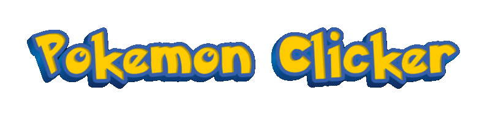
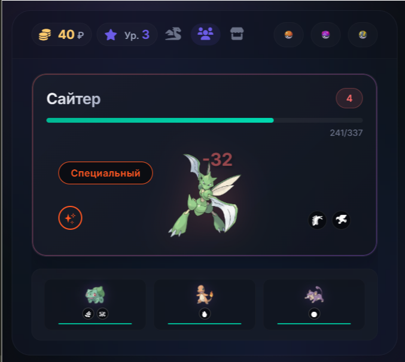
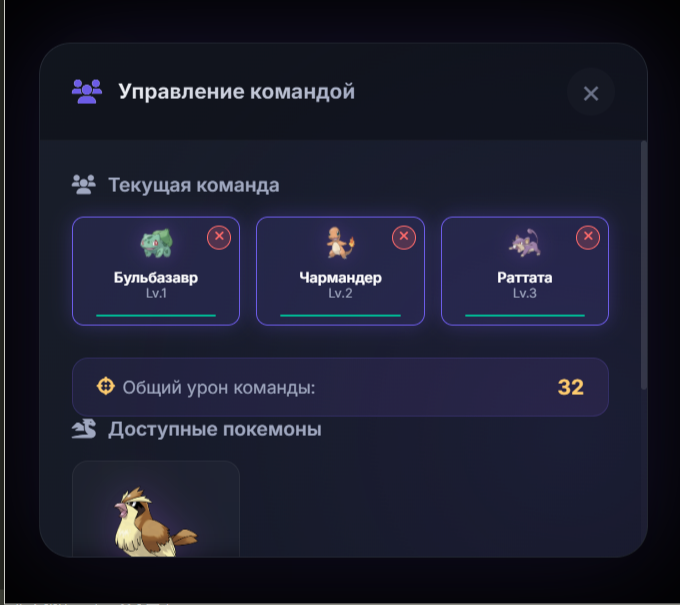
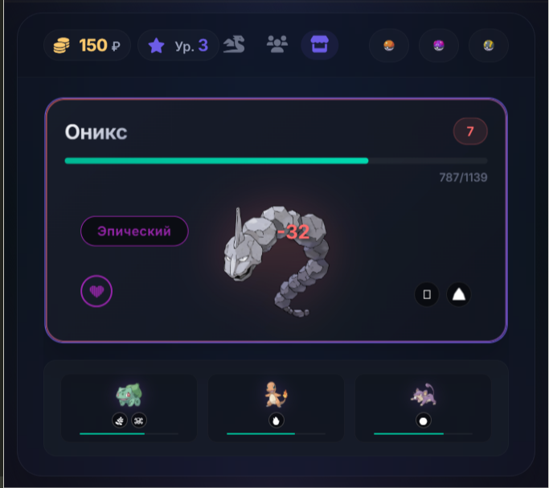
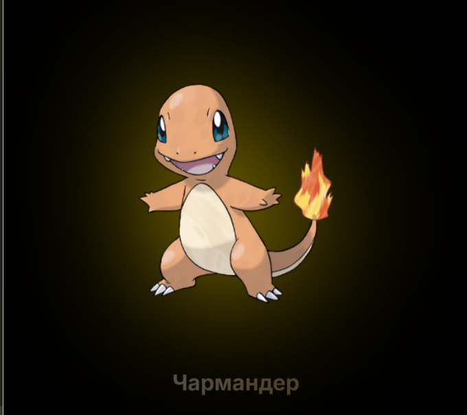
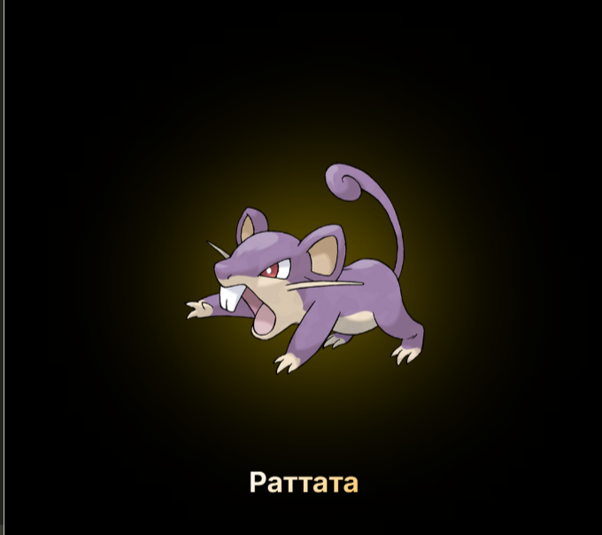
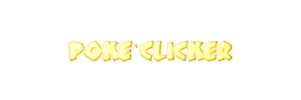

    

Добро пожаловать в мир Pokemon Clicker Battle — захватывающей инкрементальной игры, где вы становитесь тренером покемонов, сражаетесь с противниками, собираете коллекцию и развиваете свою команду!

## 🎯 Основные возможности (v0.0.4)

### ✨ Скриншоты

| Экран битвы | Экран команды |
|-----------------------------------|----------------------------|
|  |  |

| Управление | Враги |
|-----------------------|---------------------|
|  |  |

| Повышения | Эволюции |
|-----------------------|---------------------|
|  |  |

### ✅ Реализовано:
- **Боевая система** - Динамические сражения с противниками
- **Коллекция покемонов** - Сбор и хранение различных покемонов
- **Система команд** - Формирование команды до 3 покемонов
- **Магазин** - Покупка покеболов и улучшений
- **Туториал** - Пошаговое обучение для новых игроков
- **Сохранение прогресса** - Автосохранение и загрузка игры
- **Визуальные эффекты** - Анимации, эффекты урона, подсветка
- **Адаптивный дизайн** - Поддержка мобильных устройств
- **Звуковая система** - Генерация звуковых эффектов
- **Уведомления** - Информационные сообщения о событиях

### 🎮 Игровой процесс:
1. **Сбор покемонов** через покеболы
2. **Формирование команды** для битв
3. **Сражения с противниками** нажатием кнопки атаки
4. **Заработок валюты** за победы
5. **Покупка улучшений** в магазине
6. **Расширение коллекции** и команды

## 🛠 Технические особенности

### Архитектура:
- **Модульная структура** - Разделение на независимые системы
- **ООП подход** - Классы для каждой игровой системы
- **Event-driven** - Событийная модель взаимодействия

### Системы игры:
1. **SaveManager** - Управление сохранениями
2. **PokemonManager** - Работа с покемонами
3. **BattleSystem** - Боевая механика
4. **ShopSystem** - Торговля и экономика
5. **UIManager** - Управление интерфейсом
6. **AnimationManager** - Визуальные эффекты
7. **TutorialSystem** - Обучение игрока

### Технологии:
- **Чистый JavaScript** (ES6+)
- **HTML5** с семантической разметкой
- **CSS3** с Flexbox/Grid и CSS-переменными
- **LocalStorage** для сохранения прогресса
- **Font Awesome** для иконок
- **CSS-анимации** и переходы

## 🎨 Дизайн и UX

### Визуальный стиль:
- **Цветовая палитра** в стиле Pokémon
- **Карточный дизайн** элементов
- **Адаптивная верстка** для всех устройств
- **Плавные анимации** и переходы
- **Интерактивные элементы** с hover-эффектами

### Пользовательский опыт:
- **Интуитивный интерфейс** с понятными иконками
- **Пошаговый туториал** для новичков
- **Визуальная обратная связь** на действия
- **Горячие клавиши** (Пробел для атаки)
- **Автосохранение** каждые 30 секунд

### Требования:
- Современный браузер с поддержкой ES6
- Включенный JavaScript
- Доступ к локальному хранилищу

    

## 🤝 Вклад в разработку

Мы приветствуем вклад в развитие игры! Вот как вы можете помочь:

1. **Сообщения об ошибках** - Создавайте issue с описанием бага
2. **Предложения функций** - Делитесь идеями для улучшения
3. **Pull requests** - Присылайте свои улучшения кода
4. **Тестирование** - Помогите найти и исправить ошибки
5. **Документация** - Улучшайте документацию и руководства

## 📝 Лицензия

Этот проект лицензирован под MIT License - смотрите файл LICENSE для подробностей.

## 👏 Благодарности

- **The Pokémon Company** за создание вселенной Pokémon
- **Сообществу разработчиков** за вдохновение
- **Всем тестерам** за помощь в улучшении игры
- **Font Awesome** за отличные иконки

## 📞 Контакты

**Разработчик**: [@Gabryelf/GameDeva]

---

    

⭐ **Если вам нравится проект, поставьте звезду на GitHub!** ⭐

---

    

*Pokémon © 2026 Pokémon. © 1995-2026 Nintendo/Creatures Inc./GAME FREAK inc. Pokémon, имена персонажей являются товарными знаками Nintendo.*
*Эта игра является фанатским проектом и не связана с The Pokémon Company.*
